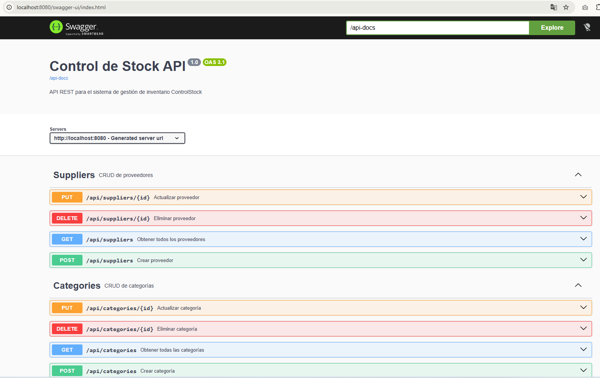
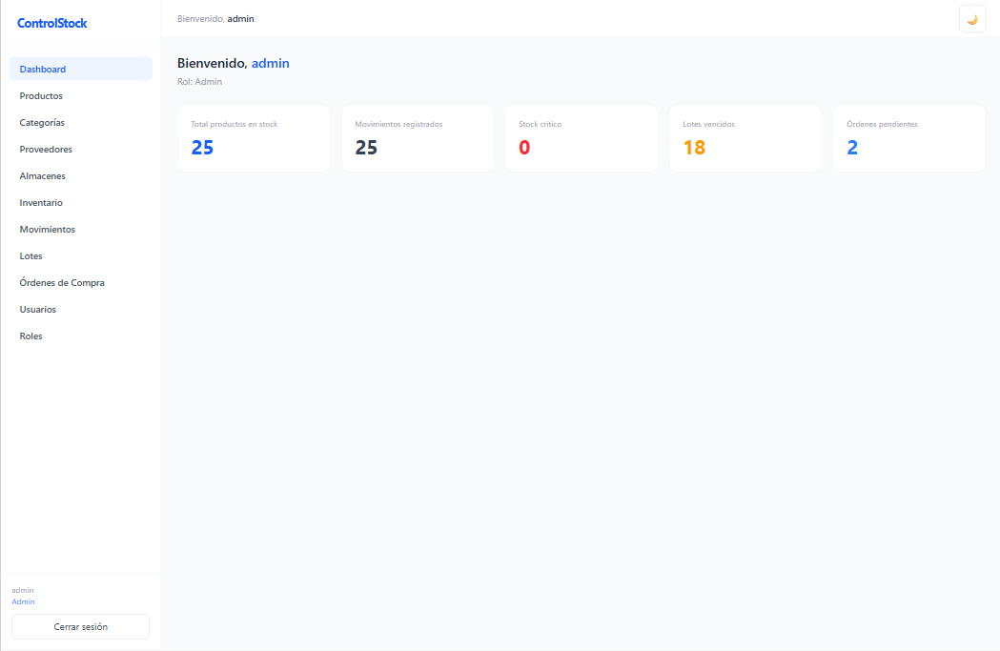
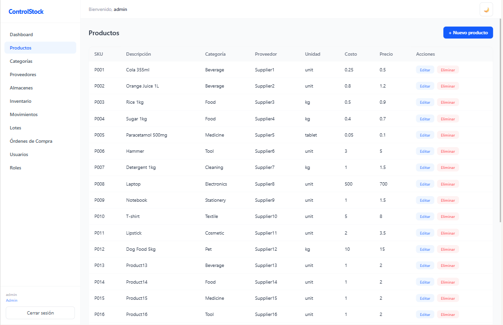
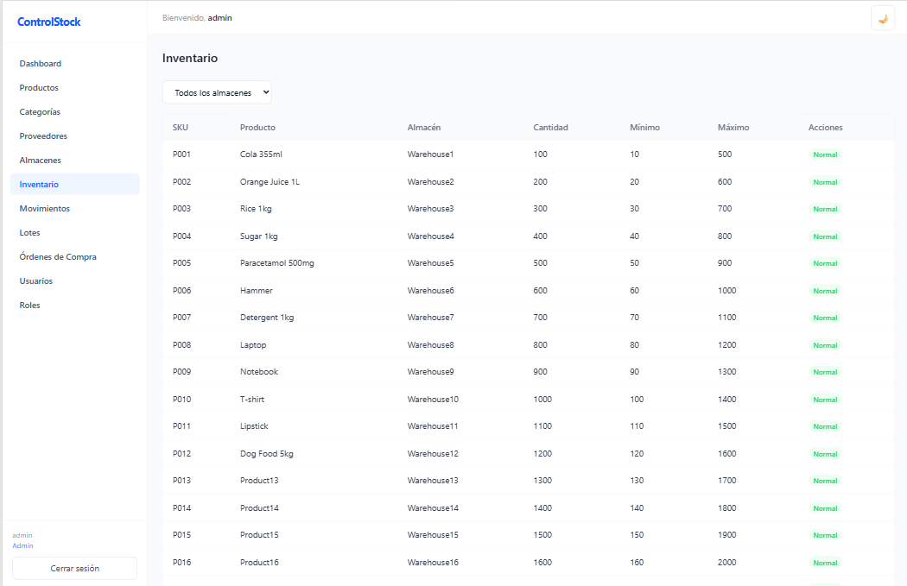

# ControlStock

Sistema de gestión de inventario para el control de stock, productos, lotes, movimientos y órdenes de compra.

---

## 📋 Descripción del Proyecto

**ControlStock** es una aplicación web full-stack desarrollada con **Spring Boot** (backend) y **React + TypeScript + Vite** (frontend) que permite a una empresa gestionar su inventario de manera eficiente.

### Problema que resuelve

Las empresas que manejan productos físicos necesitan llevar un control preciso de:
- Cuántas unidades hay disponibles de cada producto.
- Dónde están almacenados (por bodega/almacén).
- Los lotes y fechas de vencimiento de los productos.
- Los movimientos de entrada y salida de stock.
- Las órdenes de compra realizadas a proveedores.
- Los roles y permisos de los usuarios del sistema.

ControlStock centraliza toda esta información en un solo sistema, con una API REST documentada y una interfaz web intuitiva.

### Funciones principales

| Función | Descripción |
|---------|-------------|
| **Gestión de Productos** | CRUD completo: crear, listar, actualizar y eliminar productos. |
| **Categorías** | Organizar productos por categorías. |
| **Presentaciones** | Cada producto puede tener múltiples presentaciones (unidad, caja, pack, etc.). |
| **Proveedores** | Administrar la información de los proveedores. |
| **Almacenes** | Registrar las distintas bodegas o sucursales. |
| **Inventario** | Control de stock por producto y almacén. |
| **Lotes** | Gestión de lotes con fechas de vencimiento. |
| **Movimientos** | Registro de entradas y salidas de stock (historial auditado). |
| **Órdenes de Compra** | Creación y seguimiento de órdenes de compra a proveedores. |
| **Usuarios y Roles** | Autenticación JWT, roles (admin/basic) y permisos granulares. |
| **Documentación API** | Swagger UI interactivo disponible en `/swagger-ui.html`. |

---

## 🗄️ Diagrama Entidad-Relación


> El diagrama muestra las tablas y relaciones de la base de datos PostgreSQL: `products`, `categories`, `presentations`, `suppliers`, `warehouses`, `inventory`, `lots`, `movements`, `purchase_orders`, `purchase_order_details`, `users`, `roles`, `permissions`, y sus tablas intermedias.

Los scripts SQL se encuentran en la carpeta [`database/`](database/):

- [`1-create_tables.sql`](database/1-create_tables.sql) — Creación de tablas
- [`2-seed_data.sql`](database/2-seed_data.sql) — Datos de ejemplo
- [`DB_README.md`](database/DB_README.md) — Instrucciones básicas para recrear la BD

---

## 🐳 Manual de Despliegue con Docker

Solo necesitas **Docker Desktop** instalado en tu máquina.

📘 Guías de instalación:
- [Docker en Windows](https://learn.microsoft.com/es-es/virtualization/windowscontainers/manage-docker/configure-docker-daemon)
- [Docker en Linux](https://docs.docker.com/engine/install/ubuntu/)

### Paso 1: Clonar el repositorio

```bash
git clone https://github.com/GT24002/ControlStock.git
cd ControlStock
```

### Paso 2: Elegir modo de despliegue

#### Opción A — Desarrollo (BD local)

Usa tu propia instancia de PostgreSQL (local o contenedor aparte).

1. Crea la base de datos y ejecuta los scripts SQL de la carpeta [`database/`](database/).  
   → Sigue las instrucciones de [`database/DB_README.md`](database/DB_README.md).

2. Configura las credenciales en `docker-compose.yml`:
   ```yaml
   backend-dev:
     environment:
       SPRING_DATASOURCE_URL: jdbc:postgresql://host.docker.internal:5432/controlstockdb
       SPRING_DATASOURCE_USERNAME: admin
       SPRING_DATASOURCE_PASSWORD: admin123
   ```
   > ⚠️ No subas estos cambios a GitHub, son locales.

3. Levanta backend y frontend:
   ```bash
   docker compose -p controlstock-dev --profile dev up --build
   ```

| Servicio | URL |
|----------|-----|
| 🌐 Frontend | [http://localhost:5173](http://localhost:5173) |
| 🔌 Backend (API) | [http://localhost:8080](http://localhost:8080) |
| 📘 Swagger UI | [http://localhost:8080/swagger-ui.html](http://localhost:8080/swagger-ui.html) |

#### Opción B — Producción (todo con Docker)

Un solo comando levanta **PostgreSQL + Backend + Frontend**:

```bash
docker compose -p controlstock-prod --profile prod up --build -d
```

| Servicio | URL / Puerto |
|----------|--------------|
| 🌐 Frontend | [http://localhost](http://localhost) |
| 🔌 Backend (API) | [http://localhost:8081](http://localhost:8081) |
| 📘 Swagger UI | [http://localhost:8081/swagger-ui.html](http://localhost:8081/swagger-ui.html) |
| 🗄️ PostgreSQL | `localhost:5434` — usuario: `admin_prod` / contraseña: `admin_production_password` |

Para detener el entorno de producción:

```bash
docker compose -p controlstock-prod down
```

---

## 📖 Guía Docker detallada

Si quieres entender cómo funciona Docker en este proyecto, revisa:

👉 [`docker_docs/GUIA_DOCKER.md`](docker_docs/GUIA_DOCKER.md)

---

## 📡 Evidencias de Funcionamiento

### Documentación Swagger

Una vez el backend esté corriendo, la documentación interactiva de la API está disponible en:

- **Desarrollo:** [http://localhost:8080/swagger-ui.html](http://localhost:8080/swagger-ui.html)
- **Producción:** [http://localhost:8081/swagger-ui.html](http://localhost:8081/swagger-ui.html)




### Tabla de Rutas (Endpoints del Backend)

| Método | Ruta | Controlador | Descripción |
|--------|------|-------------|-------------|
| `POST` | `/auth/login` | `AuthController` | Login y obtención de token JWT |
| `GET` | `/api/products` | `ProductController` | Obtener todos los productos |
| `POST` | `/api/products` | `ProductController` | Crear producto |
| `PUT` | `/api/products/{id}` | `ProductController` | Actualizar producto |
| `DELETE` | `/api/products/{id}` | `ProductController` | Eliminar producto |
| `GET` | `/api/categories` | `CategoryController` | Obtener todas las categorías |
| `POST` | `/api/categories` | `CategoryController` | Crear categoría |
| `PUT` | `/api/categories/{id}` | `CategoryController` | Actualizar categoría |
| `DELETE` | `/api/categories/{id}` | `CategoryController` | Eliminar categoría |
| `GET` | `/api/suppliers` | `SupplierController` | Obtener todos los proveedores |
| `POST` | `/api/suppliers` | `SupplierController` | Crear proveedor |
| `PUT` | `/api/suppliers/{id}` | `SupplierController` | Actualizar proveedor |
| `DELETE` | `/api/suppliers/{id}` | `SupplierController` | Eliminar proveedor |
| `GET` | `/api/warehouses` | `WarehouseController` | Obtener todos los almacenes |
| `POST` | `/api/warehouses` | `WarehouseController` | Crear almacén |
| `PUT` | `/api/warehouses/{id}` | `WarehouseController` | Actualizar almacén |
| `DELETE` | `/api/warehouses/{id}` | `WarehouseController` | Eliminar almacén |
| `GET` | `/api/inventory` | `InventoryController` | Obtener todo el inventario |
| `GET` | `/api/inventory/warehouse/{id}` | `InventoryController` | Inventario filtrado por almacén |
| `POST` | `/api/inventory` | `InventoryController` | Crear registro de inventario |
| `PUT` | `/api/inventory/{id}` | `InventoryController` | Actualizar inventario |
| `DELETE` | `/api/inventory/{id}` | `InventoryController` | Eliminar registro de inventario |
| `GET` | `/api/movements` | `MovementController` | Obtener todos los movimientos |
| `POST` | `/api/movements` | `MovementController` | Registrar movimiento de stock |
| `GET` | `/api/lots` | `LotController` | Obtener todos los lotes |
| `POST` | `/api/lots` | `LotController` | Crear lote |
| `PUT` | `/api/lots/{id}` | `LotController` | Actualizar lote |
| `DELETE` | `/api/lots/{id}` | `LotController` | Eliminar lote |
| `GET` | `/api/purchase-orders` | `PurchaseOrderController` | Obtener todas las órdenes de compra |
| `POST` | `/api/purchase-orders` | `PurchaseOrderController` | Crear orden de compra |
| `PUT` | `/api/purchase-orders/{id}` | `PurchaseOrderController` | Actualizar orden de compra |
| `DELETE` | `/api/purchase-orders/{id}` | `PurchaseOrderController` | Eliminar orden de compra |
| `GET` | `/api/users` | `AppUserController` | Obtener todos los usuarios |
| `POST` | `/api/users` | `AppUserController` | Crear usuario |
| `PUT` | `/api/users/{id}` | `AppUserController` | Actualizar usuario |
| `DELETE` | `/api/users/{id}` | `AppUserController` | Eliminar usuario |
| `GET` | `/roles` | `RoleController` | Obtener todos los roles |
| `POST` | `/roles` | `RoleController` | Crear rol |
| `PUT` | `/roles/{id}` | `RoleController` | Actualizar rol |
| `DELETE` | `/roles/{id}` | `RoleController` | Eliminar rol |
| `GET` | `/api/permissions` | `PermissionController` | Obtener todos los permisos |
| `POST` | `/api/permissions` | `PermissionController` | Crear permiso |
| `PUT` | `/api/permissions/{id}` | `PermissionController` | Actualizar permiso |
| `DELETE` | `/api/permissions/{id}` | `PermissionController` | Eliminar permiso |
| `GET` | `/api/presentations` | `PresentationController` | Obtener todas las presentaciones |
| `GET` | `/api/presentations/product/{id}` | `PresentationController` | Presentaciones por producto |
| `POST` | `/api/presentations` | `PresentationController` | Crear presentación |
| `PUT` | `/api/presentations/{id}` | `PresentationController` | Actualizar presentación |
| `DELETE` | `/api/presentations/{id}` | `PresentationController` | Eliminar presentación |

### Vistas Frontend

El frontend incluye las siguientes vistas principales:

| Ruta | Vista | Descripción |
|------|-------|-------------|
| `/login` | Login | Pantalla de inicio de sesión |
| `/` | Dashboard | Panel principal con resumen del sistema |
| `/products` | Productos | CRUD de productos |
| `/categories` | Categorías | CRUD de categorías |
| `/suppliers` | Proveedores | CRUD de proveedores |
| `/warehouses` | Almacenes | CRUD de almacenes |
| `/inventory` | Inventario | Consulta y gestión del stock |
| `/movements` | Movimientos | Historial de movimientos de stock |
| `/lots` | Lotes | Gestión de lotes con fechas de vencimiento |
| `/purchase-orders` | Órdenes de Compra | Creación y seguimiento de órdenes |
| `/users` | Usuarios (admin) | Gestión de usuarios del sistema |
| `/roles` | Roles (admin) | Gestión de roles y permisos |


<div style="display: flex; justify-content: space-between; gap: 10px;">
  
  
  
</div>

---

## 🛠️ Stack Tecnológico

| Capa | Tecnología |
|------|-----------|
| **Frontend** | React 19, TypeScript, Vite, React Router |
| **Backend** | Java 21, Spring Boot, Spring Security, JWT |
| **Base de Datos** | PostgreSQL |
| **Documentación API** | Swagger / OpenAPI 3 |
| **Contenedores** | Docker, Docker Compose |
| **Proxy** | Nginx |

---
## 👥 Equipo — Grupo 5

| Nombre | Carnet |
|--------|--------|
| Kevin Roberto Gomez Tobar | GT24002 |
| Rafael Armando Ibañez Diego | ID24001 |
| Yohalmo Alonso Castro Siguenza | CS24009 |
| Brayan Alexander Villalta Gutierrez | VG24003 |
| Mynor Ivan Carias Martinez | CM23138 |

---